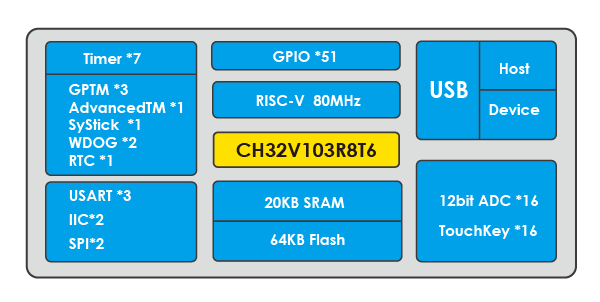
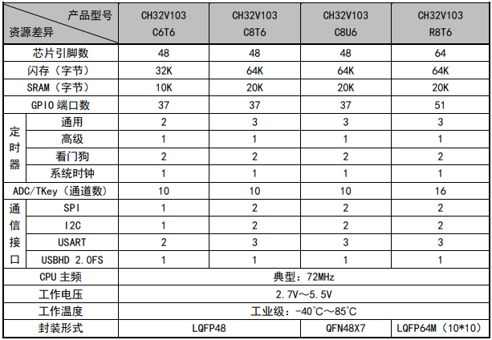

# [CH32V103](https://github.com/SoCXin/CH32V103)

* [WCH](http://www.wch.cn/)：[RISC-V3A](https://github.com/SoCXin/RISC-V)
* [L3R3](https://github.com/SoCXin/Level)：80 MHz

## [简介](https://github.com/SoCXin/CH32V103/wiki)

[CH32V103](https://github.com/SoCXin/CH32V103) 系列是以RISC-V3A处理器为核心的32位通用微控制器，该处理器是基于RISC-V开源指令集设计。片上集成了时钟安全机制、多级电源管理、通用DMA控制器。此系列具有1路USB2.0主机/设备接口、多通道12位ADC转换模块、多通道TouchKey、多组定时器、多路IIC/USART/SPI接口等丰富的外设资源。

#### 关键特性

* UART x 3 + SPI(M/S) x 2 + IIC x 2 + USB(H/S)
* CRC + 96 bit UUID
* 2.7V ~ 5.5V，GPIO同步供电电压

### [收录资源](https://github.com/SoCXin/CH32V103)

* [参考资源](src/)
* [参考文档](docs/)
* [参考工程](project/)
* [入门文档](https://docs.soc.xin/CH32V103)

### [选型建议](https://github.com/SoCXin)

[CH32V103](https://github.com/SoCXin/CH32V103)

### [探索芯世界 www.SoC.xin](http://www.SoC.Xin)
